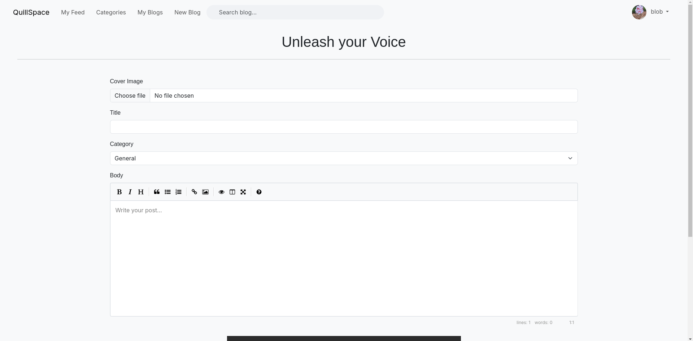

# QuillSpace - A Full-Featured Blogging Platform

**QuillSpace** is a full-stack blogging platform built with Node.js, Express, MongoDB, and EJS, enabling users to publish rich Markdown-based blog posts with images, engage through comments, and personalize their experience through likes, follows, categories, and curated feeds.

---

## Features

- **Create & Edit Posts** with rich **Markdown** support and **image uploads**
- Image management via `multer` and static hosting
- **Sort & Browse by Categories**
- **Comment system** with threaded discussions
- **Like posts** to show appreciation
- **Follow users** to build your custom feed
- **Personalized "My Feed"** view based on followed authors
- **User profiles** with editable bios and post history
- JWT-based **Authentication & Authorization**
- Modular architecture using MVC pattern with EJS templating

---

## Tech Stack

- **Frontend**: EJS, HTML, CSS, JavaScript
- **Backend**: Node.js, Express.js
- **Database**: MongoDB with Mongoose
- **Authentication**: JWT, Sessions
- **File Uploads**: Multer
- **Markdown Parsing**: `marked` with sanitization
- **View Engine**: EJS with partials and layout reuse

---

## Screenshots

**Home Page** 

**User Profile Page**

**Rich Markdown Blog Post**

**Blog Post** 

**Comment Section**

